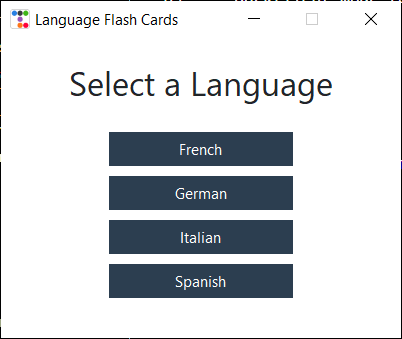
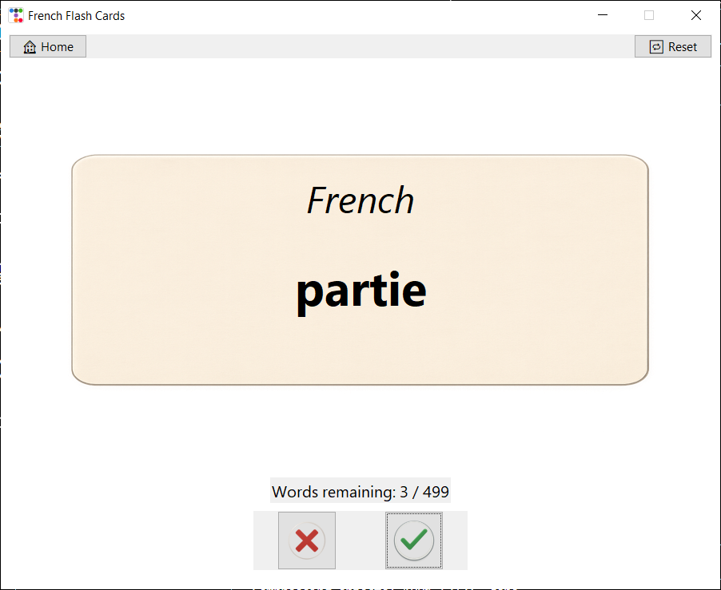
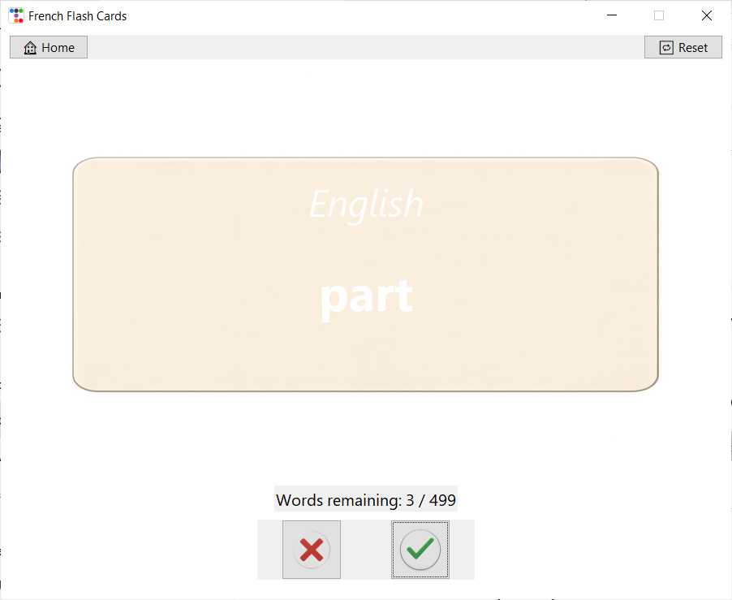
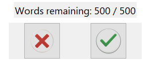
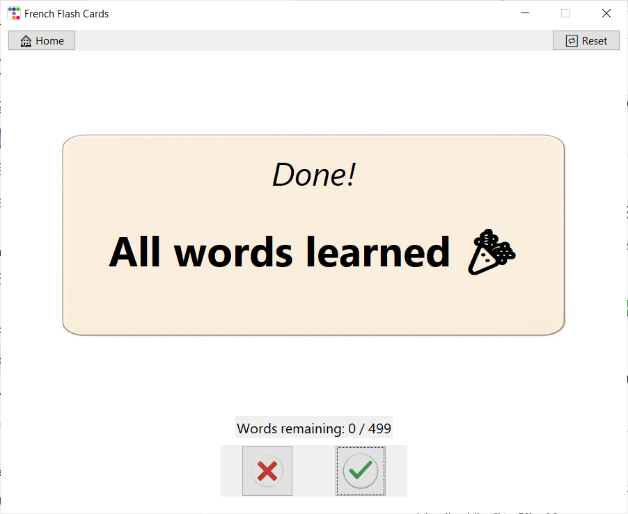

# 🧠 FlashCard Pro – Multi-Language Desktop App

An elegant, animated flashcard app that helps you master daily conversational vocabulary in multiple languages. Built with `Tkinter` and `ttkbootstrap`, this desktop tool brings together polished UI, smooth flip animations, and persistent progress tracking across four languages.

---

## 🎥 Demo


---

## 🚀 Features

- 🔤 **Multiple Language Support** – French, German, Italian, and Spanish word banks
- ✨ **Smooth Flip Animations** – Realistic flashcard front-to-back transitions
- ✅ ❌ **Mark Known/Unknown** – Known words are removed from rotation
- 💾 **Persistent Progress** – Progress is saved to disk and restored on restart
- 🔁 **Reset Anytime** – One-click reset lets you start fresh
- 🏠 **Home Navigation** – Switch between languages easily
- 🧯 **Safe Exit Handling** – Graceful shutdown with no terminal errors
- 🎨 **Modern Look** – Clean interface using `ttkbootstrap`

---

## 🖼️ Screenshots

| Language Selection | Flashcard – Front | Flashcard – Back |
|--------------------|-------------------|------------------|
|  |  |  |

| Feedback Buttons | Completion Screen |
|------------------|-------------------|
|  |  |

---

## 💻 How to Run Locally

1. **Clone the repository**
```bash
git clone https://github.com/your-username/flashcard-pro.git
cd flashcard-pro
```

2. **Install dependencies**
```bash
pip install -r requirements.txt
```

3. **Run the app**
```bash
python main.py
```

---

## 📚 What I Learned

- Creating multi-screen Tkinter apps with smooth state transitions
- Handling and debugging asynchronous animations using `.after()` callbacks
- Managing persistent state using local JSON files
- Designing user-friendly UIs using `ttkbootstrap`
- Building reusable logic with modular `data_manager.py` and clean UI structure

---

## 🧪 Tech Stack

- `Python 3`
- `Tkinter`
- `ttkbootstrap`
- `Pillow (PIL)`
- `pandas`

---

## 🌱 Future Improvements

- Sound effects when flipping cards or completing decks
- Dark/light mode toggle
- Web-based version using Flask or Django
- Keyboard shortcuts for ❌ and ✅
- Stats dashboard (words learned, time spent, etc.)
- Support for user-added word packs

---

## 🗂️ Project Structure

```
flash_card_app/
│
├── assets/                 # CSV word lists (french_words.csv, etc.)
├── progress/               # Progress-tracking JSON files
├── images/                 # Card front/back + icon images
├── media/
│   ├── demo/               # GIF demo
│   └── screenshots/        # Screenshot PNGs used in README
├── flashcard_ui.py         # Flashcard UI logic and animation
├── data_manager.py         # Word loading and progress management
├── main.py                 # Home screen launcher
├── requirements.txt        # Project dependencies
└── README.md               # This file
```
